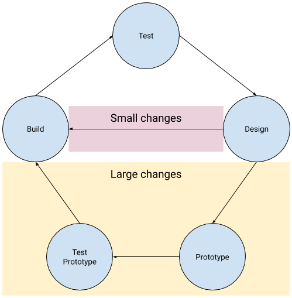

## Iterate on your solution
Now that you have a working solution, it’s time to check that it works for other people. You need to find people to test your solution on, ideally different people to those you’ve previously tested with, and ask them to use the solution. Again, tell them what it’s supposed to do for them, but don’t tell them how it’s supposed to work.

Take notes on what worked as you expected, any bugs or issues you found, and where the user struggled. Think about how to resolve those issues and update your designs with your solutions.

Decide whether it’s worth building a new prototype to test the design — this might make sense if it’s a big change — or whether you can just create an updated version of the finished solution. Then test the change and see if it resolved the issue.

Repeat the cycle until you’re happy to release the result to your users!