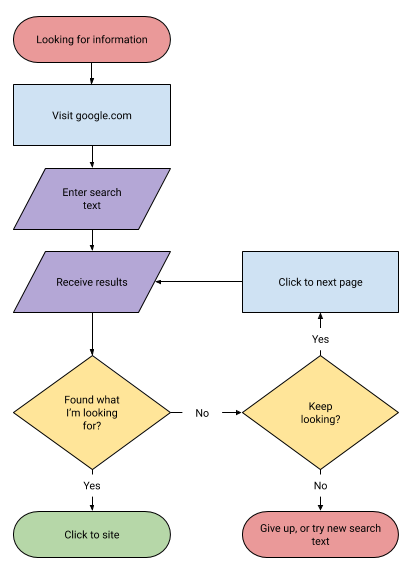
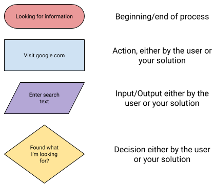
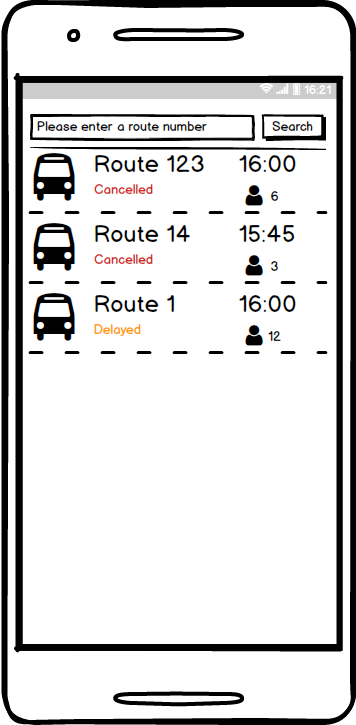

## Design your solution
Once you’ve picked one or more ideas you want to move forward with, the next step is to create a design for your idea. The design for a solution will depend on what the specifics of what it is you intend to build, but it will usually be a combination of flowcharts and drawings that represent how users will use your solution and what the user interface will look like at each point in that interaction. These can be drawn by hand, or created using software like [Google Drawings](https://docs.google.com/drawings/).

It can also be useful to make a list of parts that your solution will have — either physical parts for a hardware solution, or different functions for a software one.

### Flowcharts
Flowcharts are used to show the actions and activity that take place during users’ interactions with your solution. They use simple geometric shapes to indicate different types of interaction and can help you when designing code, recognizing similarities in different parts of your solution, or even locating pathways down which your users can become lost.

Here is an example of the flowchart for a simple Google search:

The meaning of the symbols is as follows:

### Drawings
The drawings you make should, initially, be more focused on the key elements that will form part of your solution rather than the specifics of those elements. For example, it matters more when understanding the user experience to know that there will be a light, rather than knowing it will be an orange LED; likewise, knowing the colour and font used on a button in a web page is less important than knowing that there will be a button, where it will be placed, and what it will say. As such, it is often better to draw in a deliberately low-fidelity (not looking very similar to the finished product) style now and to only create high-fidelity (looking very similar to the finished product) design once you’ve had a chance to test your designs and get user feedback.

--- collapse ---
---
title: See an example
---

A couple of things to note: 

  - The layout doesn’t bother with any particular style or fonts.
  - The only colours used are those that serve a specific function in the design — to allow the user to see whether a bus is delayed or cancelled without having to even read the text.
--- /collapse ---